- [1 接入Atmosplay Ads SDK和AdMob SDK](#1-%e6%8e%a5%e5%85%a5atmosplay-ads-sdk%e5%92%8cadmob-sdk)
  - [1.1 添加Atmosplay Ads SDK依赖](#11-%e6%b7%bb%e5%8a%a0atmosplay-ads-sdk%e4%be%9d%e8%b5%96)
  - [1.2 添加AdMob广告SDK依赖](#12-%e6%b7%bb%e5%8a%a0admob%e5%b9%bf%e5%91%8asdk%e4%be%9d%e8%b5%96)
  - [1.3 将Atmosplay Adapter导入到工程中](#13-%e5%b0%86%e5%8f%af%e7%8e%a9adapter%e5%af%bc%e5%85%a5%e5%88%b0%e5%b7%a5%e7%a8%8b%e4%b8%ad)
- [2 在AdMob平台添加Atmosplay Ads广告源](#2-%e5%9c%a8admob%e5%b9%b3%e5%8f%b0%e6%b7%bb%e5%8a%a0atmosplay-ads%e5%b9%bf%e5%91%8a%e6%ba%90)
  - [2.1 添加新应用](#21-%e6%b7%bb%e5%8a%a0%e6%96%b0%e5%ba%94%e7%94%a8)
  - [2.2 添加新广告位](#22-%e6%b7%bb%e5%8a%a0%e6%96%b0%e5%b9%bf%e5%91%8a%e4%bd%8d)
  - [2.3 添加Atmosplay Ads广告源](#23-%e6%b7%bb%e5%8a%a0atmosplay-ads%e5%b9%bf%e5%91%8a%e6%ba%90)
- [3 测试](#3-%e6%b5%8b%e8%af%95)


## 1 接入Atmosplay Ads SDK和AdMob SDK
以Android Studio为例，接入AdMob请查看[AdMob SDK接入文档](https://developers.google.com/admob/android/quick-start)，以下简要步骤
### 1.1 添加Atmosplay Ads SDK依赖
在app Module的build.gradle文件中添加
```
dependencies {
    implementation 'com.atmosplayads:atmosplayads:3.0.0'
}
```
### 1.2 添加AdMob广告SDK依赖
a. 在project构建文件(gradle)中的allprojects.repositories结点添加以下代码
```
maven {
    url "https://maven.google.com"
}
```
使其看起来像：
```
allprojects {
    repositories {
        maven {
            url "https://maven.google.com"
        }
    }
}
```
b. 在app Module的build.gradle文件中添加（可选）
```
dependencies {
    implementation 'com.google.android.gms:play-services-ads:17.2.0'
}
```

### 1.3 将Atmosplay Adapter导入到工程中
Bannder Adapter：[AtmosplayAdsBanner.java](./admobadapter/src/main/java/com/atmosplayads/admobadapter/AtmosplayAdsBanner.java)

插屏Adapter：[AtmosplayAdsInterstitial.java](./admobadapter/src/main/java/com/atmosplayads/admobadapter/AtmosplayAdsInterstitial.java)

激励视频Adapter：[AtmosplayRewardedVideo.java](./admobadapter/src/main/java/com/atmosplayads/admobadapter/AtmosplayRewardedVideo.java)

Admob激励视频老版本的Adapter：[AtmosplayAdsRewardedVideoLegacy.java](./admobadapter/src/main/java/com/atmosplayads/admobadapter/AtmosplayAdsRewardedVideoLegacy.java)

工具类(包含解析 admob 后台配置的信息，转换错误码等功能)：[AtmosplayAdsUtil.java](./admobadapter/src/main/java/com/atmosplayads/admobadapter/AtmosplayAdsUtil.java)

> 关于适配类和请求的详细内容，请参考[DEMO](https://github.com/Atmosplay/AdMobAdapter-AtmosplayAds-Android)中的代码。

## 2 在[AdMob平台](https://apps.admob.com/v2/home)添加Atmosplay Ads广告源
### 2.1 添加新应用
a. 选择目录中Apps，点击“ADD APP”按钮
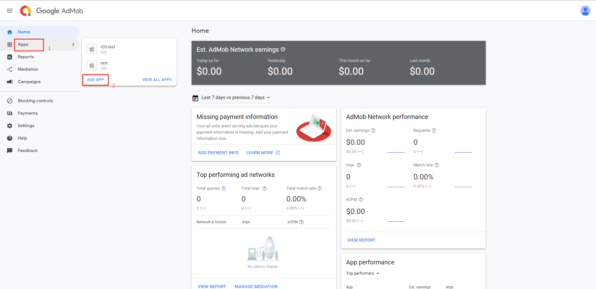

b. 选择您的应用是否已经上架Google Play或App Store，如果已上架，选择“YES”，如果未上架，选择“NO”，以下以未上架为例
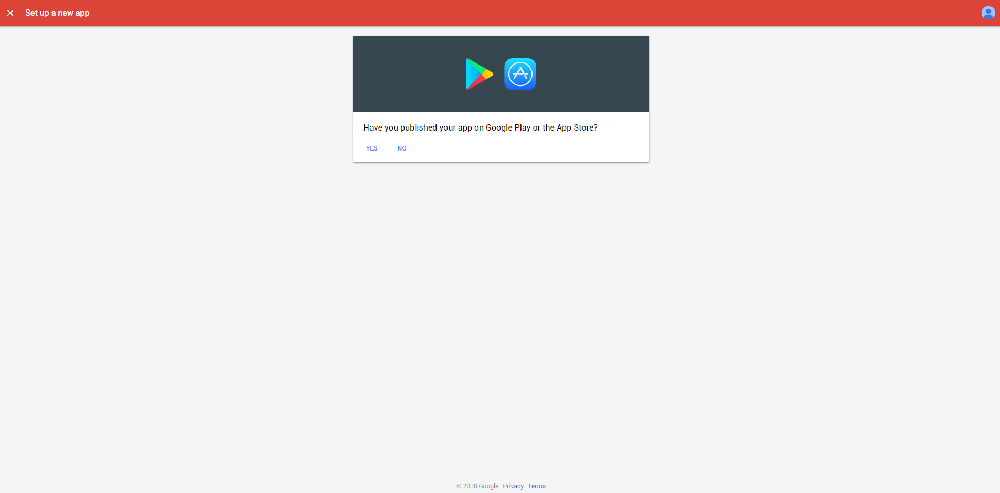

c. 输入应用名称，选择应用操作系统，点击“ADD”保存添加的应用
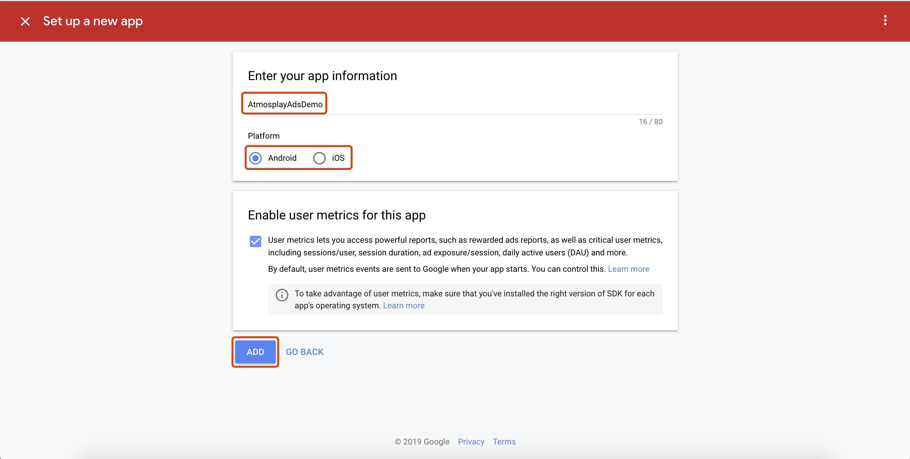

### 2.2 添加新广告位
a. 添加应用后，点击“NEXT: CREATE AD UNIT”按钮可为此应用添加广告位
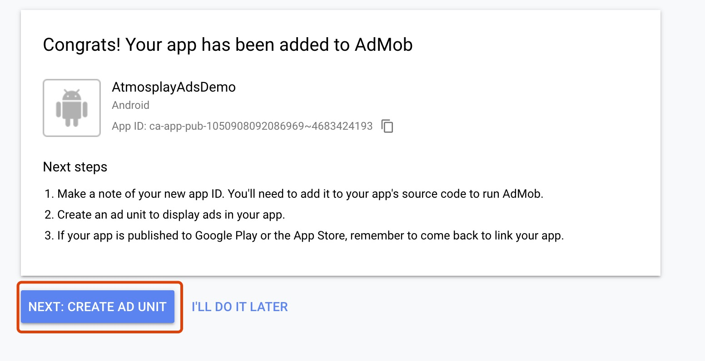

b. 选择您所需要的广告形式，Atmosplayads Ads目前支持Banner, Interstitial及Rewarded，此处以Rewarded为例


c. 输入广告位名称并点击“CREATE AD UNIT”保存添加的广告位

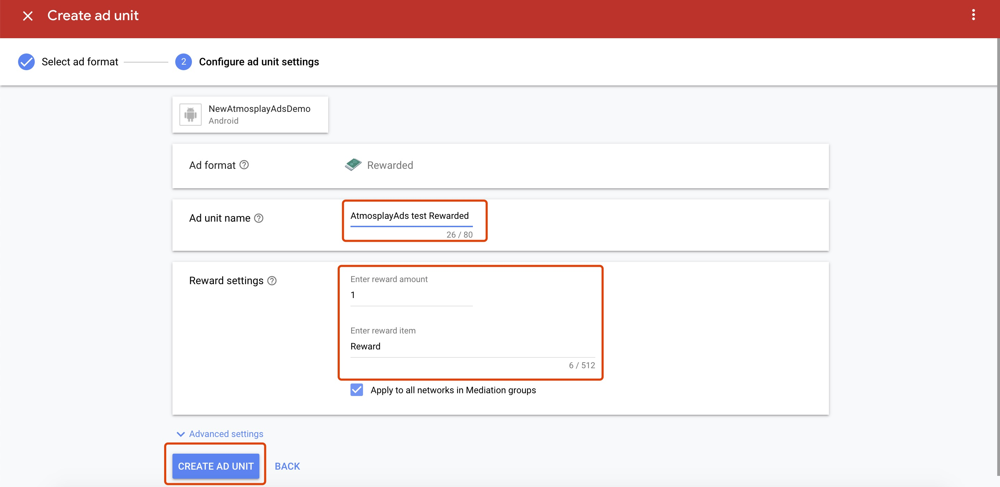

d. 获取此广告位的app ID及ad unit ID，点击“DONE”完成广告位的创建

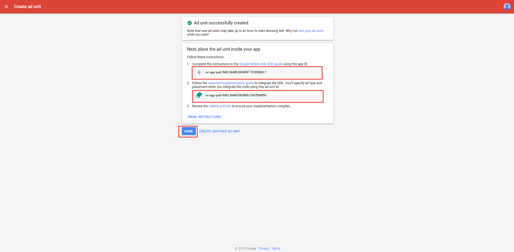

### 2.3 添加Atmosplay Ads广告源
a. 目录中选择“[Mediation](https://apps.admob.com/v2/mediation/groups/list)”，选择“CREATE MEDIATION GROUP”

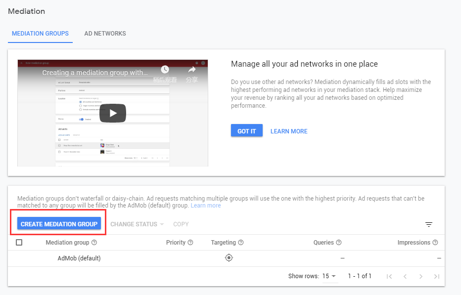

b. 选择您要使用的广告形式及操作系统，Atmosplayads Ads目前支持Banner, Interstitial及Rewarded，此处以Rewarded为例，点击“CONTINUE”进入下一步

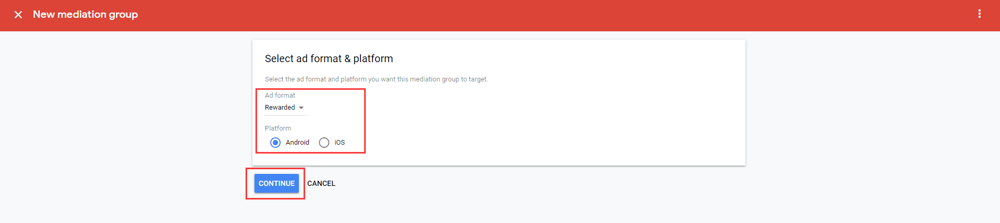

c. 输入Mediation名字，通过Location进行地域设置，状态置位Enable时Mediation才可生效，请确保状态为Enable。点击“ADD AD UNIT”选择要添加的广告位

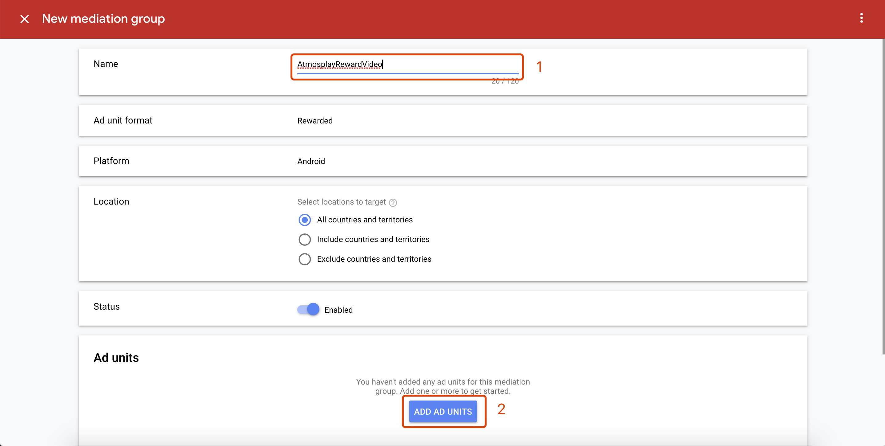

d. 在广告位选择框中，先后选择所需应用及广告位，点击“DONE”保存所配置的广告位

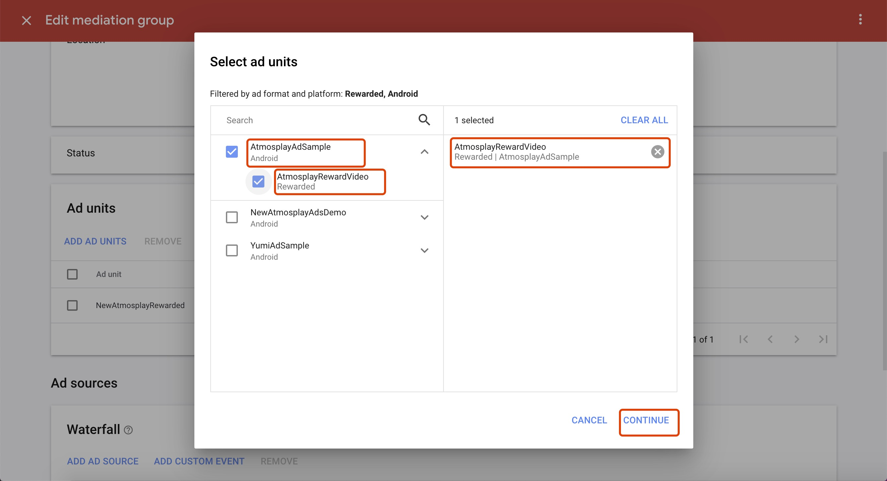

e. 点击“ADD CUSTOM EVENT”添加自定义广告源

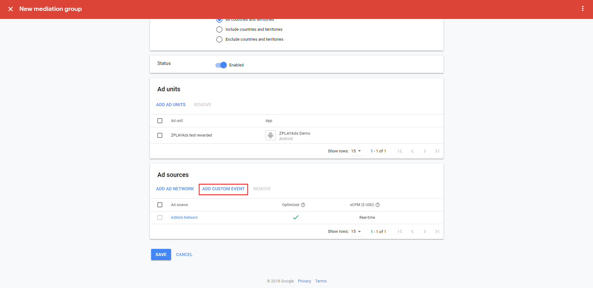

f. 输入第三方广告源名称，此处以Atmosplay Network为例，可根据需求进行自定义，根据需要对第三方广告源进行价格设置

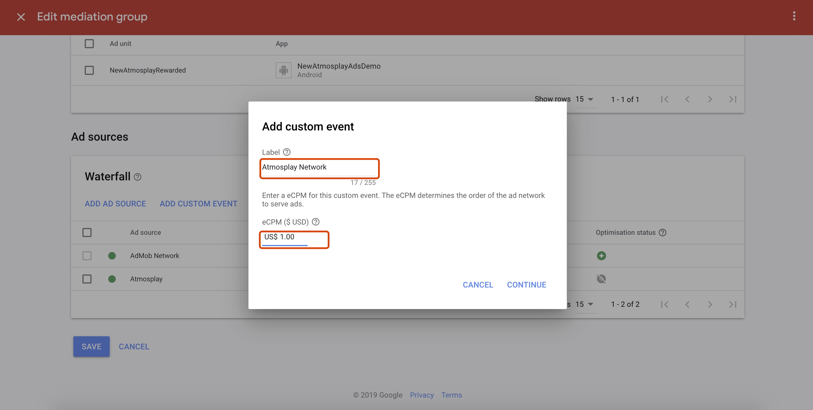

g. 对Atmosplay Network广告源进行配置。在Class Name中填写完整的适配器类名，以demo中适配器类名为例，

Banner为

`com.atmosplayads.admobadapter.AtmosplayAdsBanner`

插屏为

`com.atmosplayads.admobadapter.AtmosplayAdsInterstitial`

激励视频为

`com.atmosplayads.admobadapter.AtmosplayAdsRewardedVideo`

Parameter中需填写您在Atmosplay Ads申请的[应用ID](https://sellers.atmosplay.net/#/app/appList/)和[广告位ID](https://sellers.atmosplay.net/#/ad/placeList/)两个参数，点击“DONE”完成Atmosplay Ads的配置

```json
{"appId":"youAppId","unitId":"yourUnitId"}
```
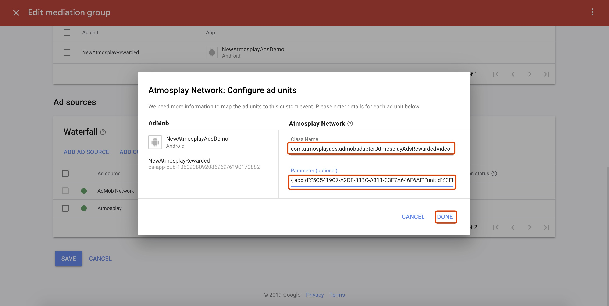

h. Ad source列表中可以看到所设置的广告源Atmosplay Network，点击“SAVE”完成Mediation的配置

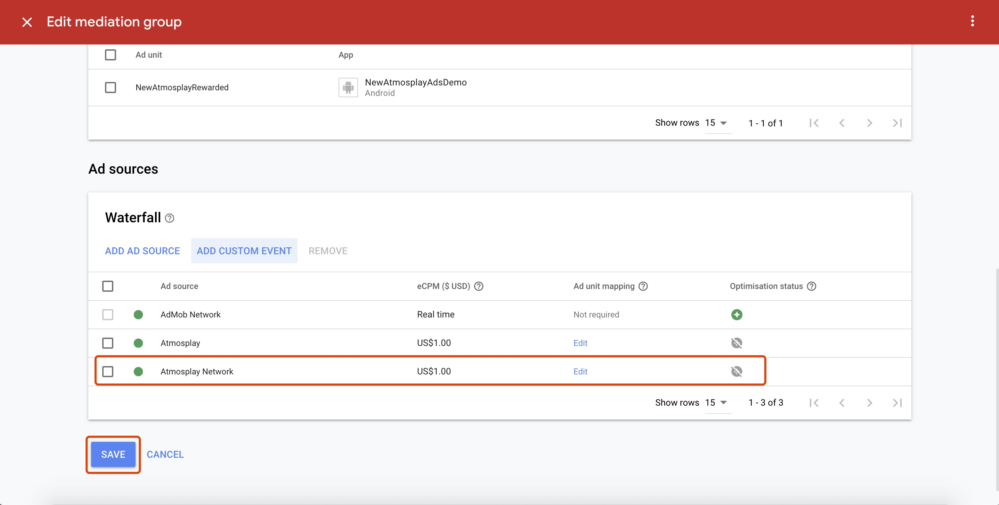

i. 检查第三方广告源是否添加完成，在[Apps列表](https://apps.admob.com/v2/apps/list)中找到步骤d中选择的应用及广告位，广告位Mediation groups中active数量增加表示广告源添加成功

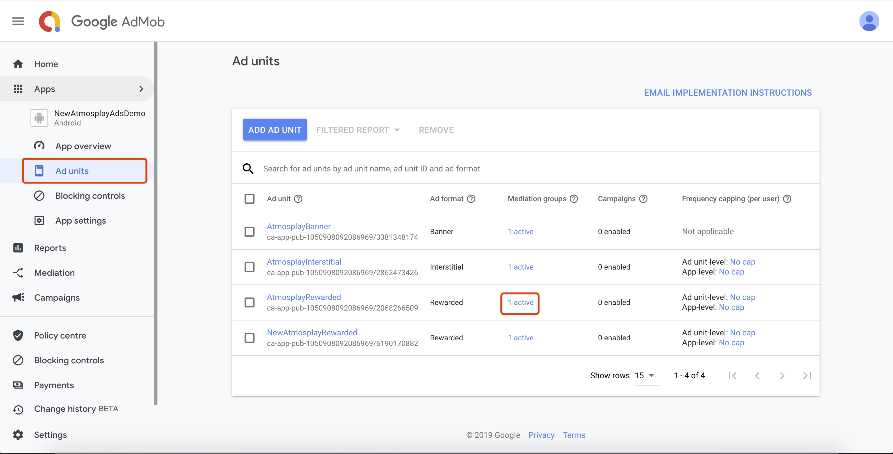

## 3 测试

您在测试中可使用如下ID进行测试，测试ID不会产生收益，应用上线时请使用您在[Atmosplay Ads](https://sellers.atmosplay.net/#/app/appList/)申请的正式ID。

| 广告形式 | App_ID                               | Ad_Unit_id                           |
| -------- | ------------------------------------ | ------------------------------------ |
| Banner广告 | 5C5419C7-A2DE-88BC-A311-C3E7A646F6AF | F22F347B-3D57-0C70-0B13-EFCFDF402EBA |
| 激励视频 | 5C5419C7-A2DE-88BC-A311-C3E7A646F6AF | 3FBEFA05-3A8B-2122-24C7-A87D0BC9FEEC |
| 插屏广告 | 5C5419C7-A2DE-88BC-A311-C3E7A646F6AF | 19393189-C4EB-3886-60B9-13B39407064E |
